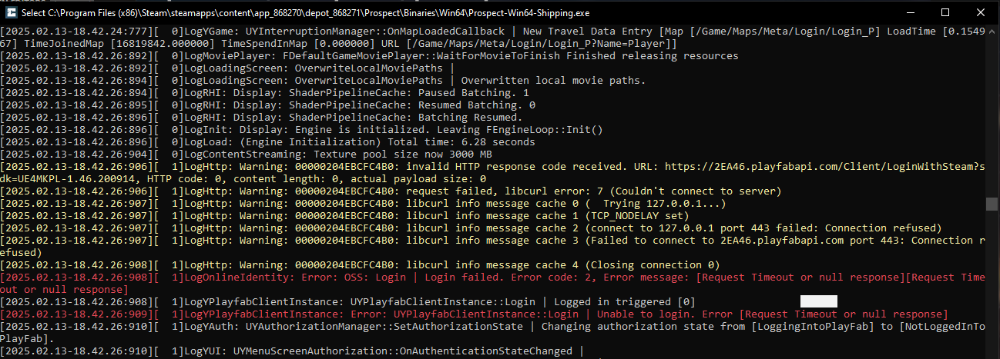
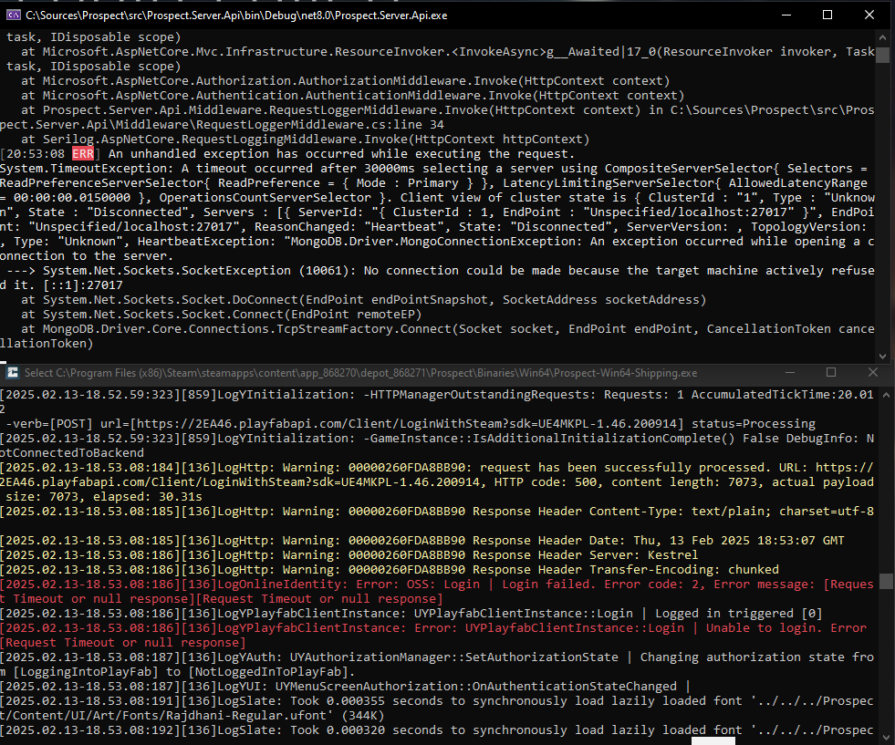

# Prospect

Also known as "The Cycle: Frontier".

## Features

* [x] Basic login with Steam.
* [x] EULA acceptance.
* [x] Tutorial.
* [x] Single-player station (Season 2 and Season 3).
* Basic station functionality:
  * [ ] Onboarding
    * [x] Talk to Badum
    * [x] Equip items
    * [ ] Deploy to Fortuna
  * [ ] Matchmaking
    * [x] Can deploy through matchmaking
    * [ ] Items insurance
    * [ ] Free loadouts (Season 3)
  * [ ] Gameplay
    * [ ] Can evac
    * [ ] Can do quests
  * [ ] Inventory and loadout
    * [x] Items can be equipped
    * [x] Items can be unequipped.
    * [x] Loadout is carried into matchmaking
    * [x] Items are automatically stacked
    * [x] Weapon mods can be equipped
    * [x] Weapon appearance can be changed
  * [ ] Quests
    * [x] Quests can be accepted
    * [ ] Quests can be removed
    * [ ] Quests can be completed
    * [ ] Job boards
  * [x] Faction progression
  * [ ] Season pass
  * [x] Character appearance and emotes
  * [ ] Shops
    * [x] Items can be bought
    * [x] Items can be sold (balance and progression is received)
  * [ ] Crafting station
  * [ ] Season pass
  * [ ] Quarters
    * [ ] Generator
    * [ ] Quarter upgrades
  * [x] Player balance
    * [x] K-Marks
    * [x] Aurum
    * [x] Insurance Tokens

## Running locally

> [!NOTE]
> If you've already done all steps previously, you can skip to Step 7.

### 1. Prerequisites

Before you start, you'll need the following software downloaded and installed:

1. [MongoDB Community Edition](https://fastdl.mongodb.org/windows/mongodb-windows-x86_64-8.0.4-signed.msi).

1. [Latest `Prospect.Server.Api`](https://github.com/deiteris/Prospect/releases) from the Releases section

1. [.NET Runtime 8.0](https://aka.ms/dotnet-core-applaunch?missing_runtime=true&arch=x64&rid=win-x64&os=win10&apphost_version=8.0.11) installed.

1. [ASP.NET Core 8.0](https://aka.ms/dotnet-core-applaunch?framework=Microsoft.AspNetCore.App&framework_version=8.0.0&arch=x64&rid=win-x64&os=win10) installed.

1. A compatible The Cycle: Frontier game client. The server works with:

   1. The latest version from [Steam](https://steamcommunity.com/app/868270).

      > [!WARNING]
      > The latest version of The Cycle: Frontier does not work with Windows 11 24H2!

   1. Season 2 client downloaded from SteamDB using a depot downloader. For example, [version 2.7.2](https://steamdb.info/depot/868271/history/?changeid=M:4623363103423775682).

### 2. Unpack `Prospect.Server.Api`

Use your favorite ZIP archiver and unzip the `Prospect.Server.Api.zip` downloaded from this repository.

### 3. Patch the `hosts` file

To be able to connect to the locally running server, you must replace the IP address of `2EA46.playfabapi.com` that the game uses. Do the following:

1. Open Notepad as Administrator.

1. Click **File** > **Open...** and select `C:\Windows\System32\drivers\etc\hosts`.

1. At the end of the file, add `127.0.0.1 2EA46.playfabapi.com` on a new line. Do not add the `#` character!

### 4. Generate and import SSL certificate

> [!IMPORTANT]
> Do not share the generated certificate! Generated certificate includes a private key that may be used to generate other certificates and compromise your security.

A connection to the server is served over a secured connection. The server uses self-signed certificate that must be added to trusted authorities in order for the game
to successfully communicate with the local server. Do the following:

1. Open the folder with `Prospect.Server.Api`.

1. Double-click `generate_ssl.exe`. `certificate.pfx` will appear in the same folder.

1. Double-click `certificate.pfx`. The Certificate Import Wizard will open:

    1. Select **Current User** under Store Location and click **Next**.

    1. Leave **File to Import** unchanged and click **Next**.

    1. Leave **Password** empty and click **Next**.

    1. Select **Place all certificates in the following store** > **Browse...**. Choose **Trusted Root Certification Authorities** and click **OK**. Click **Next**.

    1. Click **Finish**. A Security Warning popup may appear, make sure it specifies `2EA46.playfabapi.com` certification authority and click **Yes**.

### 5. Add `steam_appid` to the game

1. Open the folder with The Cycle: Frontier and navigate to **Prospect** > **Binaries** > **Win64**.

1. Right-click in the folder > **New** > **Text Document**, and name it `steam_appid`.

1. Open `steam_appid` and enter `480`.

1. Save and close the file.

### 6. Create a game shortcut with specified arguments

1. Open the folder with The Cycle: Frontier and navigate to **Prospect** > **Binaries** > **Win64**.

1. Right-click `Prospect-Win64-Shipping.exe` > **Create Shortcut**.

1. Right-click the created shortcut > **Properties**.

1. In the **Target** field, add the following parameters after the quote ` -empty -server -log -windowed -noeac -nointro -steam_auth PF_TITLEID=2EA46`. Note the space after the quote.

1. Move the shortcut to desktop.

### 7. Run the server

Now you are all set! Open the folder with `Prospect.Server.Api` and run `Prospect.Server.Api.exe`. It will open a console if it runs successfully.

> [!IMPORTANT]
> Do not close the console when you run the game.
>
> If the console does not open, make sure you have [.NET Runtime 8.0](https://aka.ms/dotnet-core-applaunch?missing_runtime=true&arch=x64&rid=win-x64&os=win10&apphost_version=8.0.11) and [ASP.NET Core 8.0](https://aka.ms/dotnet-core-applaunch?framework=Microsoft.AspNetCore.App&framework_version=8.0.0&arch=x64&rid=win-x64&os=win10) installed.

### 8. Run the game

Once the server is running, make sure that Steam is running and open The Cycle: Frontier using the shortcut you've created before.

### Troubleshooting and FAQ

#### How to remove the certificate?

If you've installed the certificate for the **Current User**:

1. Open **Start** and enter `certmgr.msc`.

1. Expand **Trusted Root Certification Authorities** and select **Certificates**.

1. Find `2EA46.playfabapi.com`, right-click it > **Delete**.

If you've installed the certificate for the **Local Machine**, repeat the same steps but instead open `certlm.msc`.

#### `generate_ssl.exe` is flagged as a virus

`generate_ssl.exe` is a Python application packed with PyInstaller and some anti-viruses may flag it as a virus.
This application is a simple certificate generator and you can find its source code in `utils/generate_ssl.py`.

#### Body parts are missing with Season 3 client

Currently, the server loads body part IDs for Season 2 by default, so this is expected. You can fix this by going to station and changing your character appearance. This will store the updated body part IDs for your character.

#### Prospect.Server.Api does not start

Make sure you have [.NET Runtime 8.0](https://aka.ms/dotnet-core-applaunch?missing_runtime=true&arch=x64&rid=win-x64&os=win10&apphost_version=8.0.11) and [ASP.NET Core 8.0](https://aka.ms/dotnet-core-applaunch?framework=Microsoft.AspNetCore.App&framework_version=8.0.0&arch=x64&rid=win-x64&os=win10) installed.

#### Login Failed. Error code: 3

Make sure that:

* You have Steam running.
* You have created and **saved** the `steam_appid` file as described in step 6.
* The `steam_appid` file type is "TXT File".

#### Login Failed. Error code: 5

Make sure that:

* `Prospect.Server.Api` server is running.
* The `C:\Windows\System32\drivers\etc\hosts` file contains `127.0.0.1 2EA46.playfabapi.com` and that the file is **saved**.

If the server works and the `hosts` file is saved, `Alt+Tab` to a game console that opens when you start the game and check for the following:

* `libcurl error 7 (Couldn't connect to server)` - indicates that the `Prospect.Server.Api` is not running.
  

* `InvalidAPIEndpoint` - indicates that the `hosts` file was not updated properly.
  

* `libcurl error 60 (Peer certificate cannot be authenticated with given CA certificates)` - indicates that the certificate was not installed correctly. Make sure that the certificate is present in `certmgr.msc` and there is only one certificate. Try removing the certificate and importing it again by following step 4.
  

* `HTTP error code 500` - usually indicates that MongoDB is not running. Make sure that MongoDB is installed and and that `MongoDB Server` is running in `services.msc`.
  

## Development

TBD